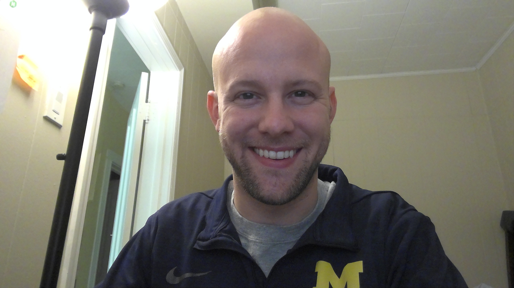

# A little insight into me, Ben Don
Hi Everyone! My name is Ben Don and I am the author of no books. This README will give you a bit of information about me!

# My Career Passions
I think the future is full of robots and I want to help get us there quickly, safely, and ethically. I have an educational background in mechanical engineering and robotics. I also have a educational background in business processes & negotiations. In my work, I've been drawn to sales as a way to balance my technical skills with business and process improvement opportunities. I am globally-minded and speak a variety of languages such as Spanish, Chinese, and a bit of Japanese.

# My Hobbies
I love learning. I read a lot. I practice the drum set (electric mostly). And for exercise and social interaction, I enjoy cycling.

# My Books
Many, many. So many books.
